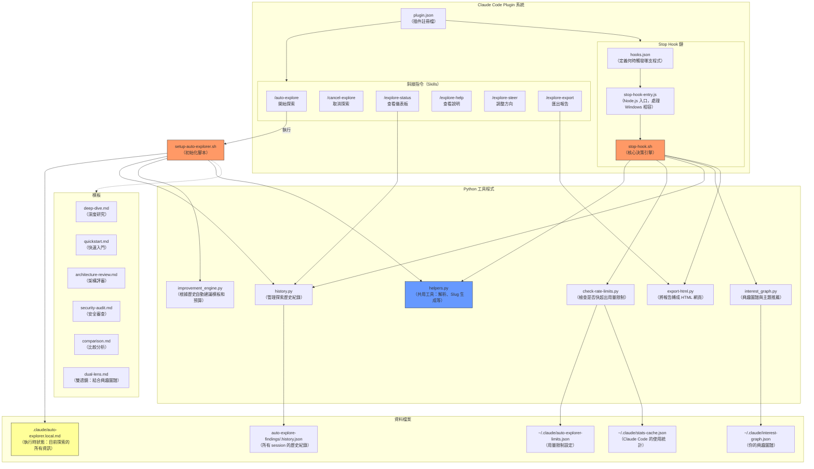
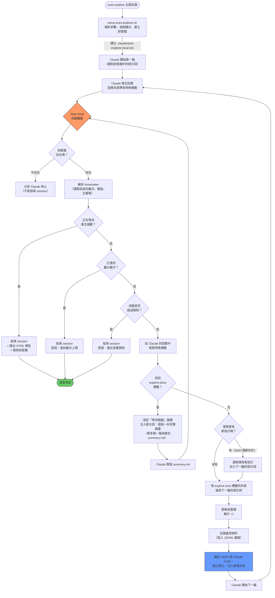
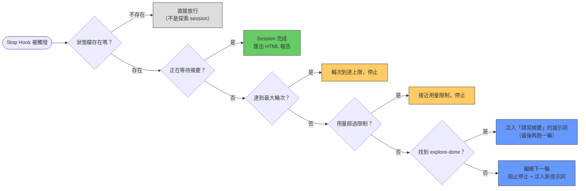
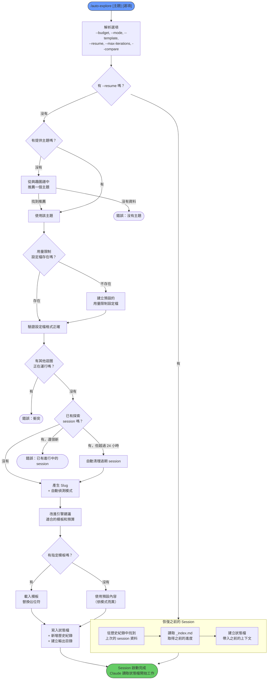
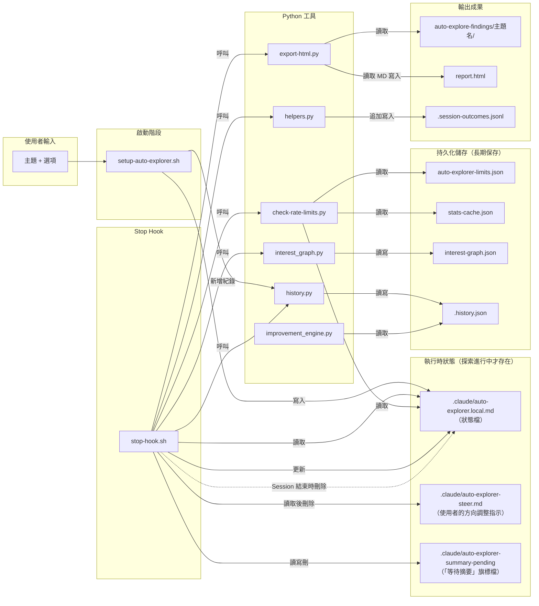
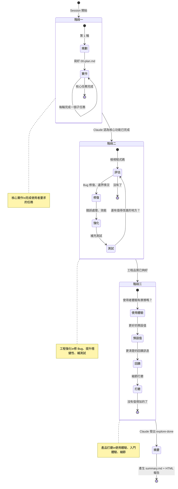
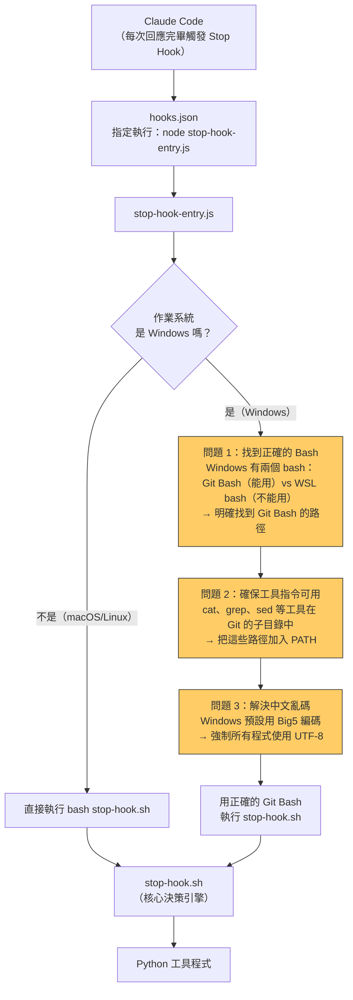
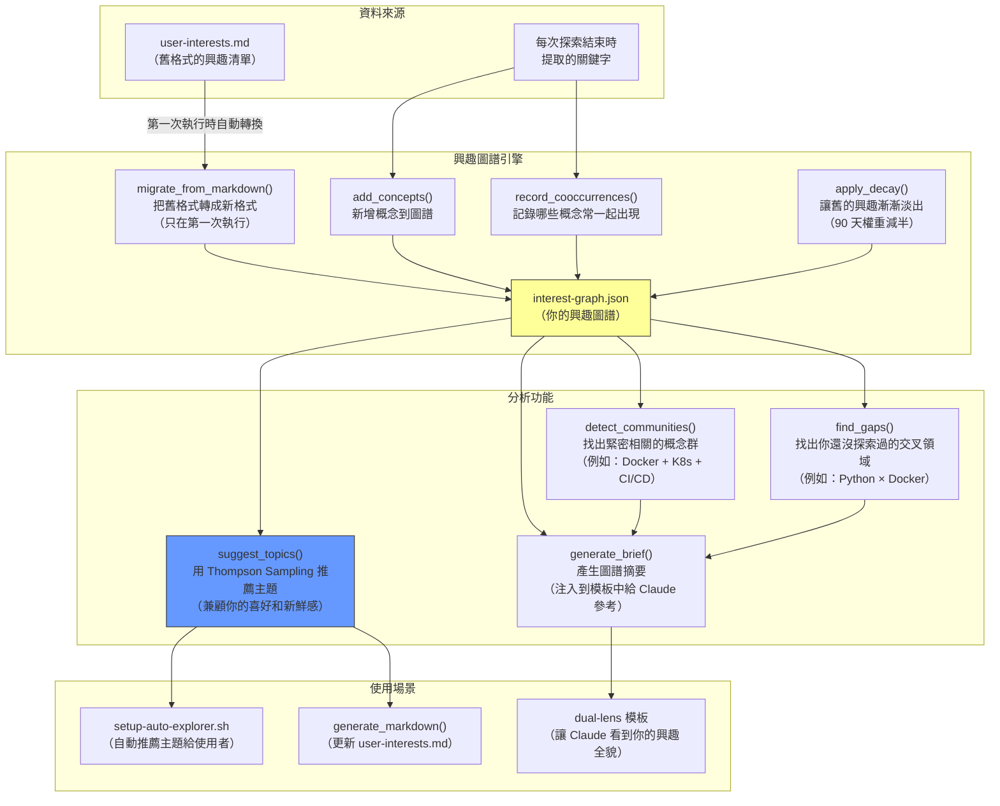
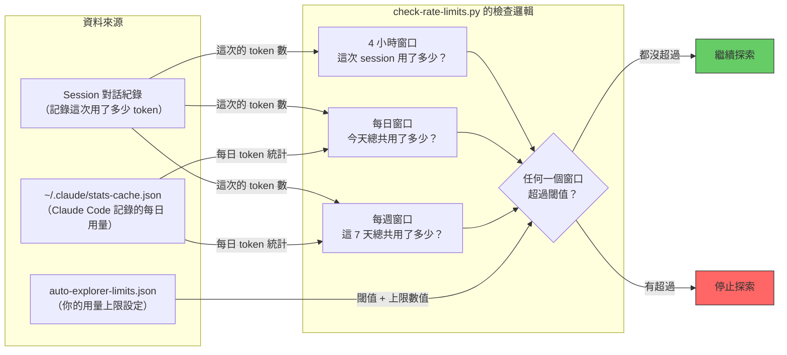

# Auto-Explorer 架構總覽

本文件用流程圖說明 Auto-Explorer 的運作方式。如果你是第一次接觸這個專案，建議從**術語表**開始閱讀。

> 本文件中的圖表使用 [Mermaid](https://mermaid.js.org/) 語法。在 GitHub 上可以直接渲染，在 VS Code 中需安裝 Mermaid 擴充套件才能看到圖形。

---

## 術語表

以下是本文件和整個專案中會用到的術語。先讀過一遍，之後遇到不懂的詞可以回來查。

### 基礎概念

| 術語 | 說明 |
|------|------|
| **Plugin（插件）** | 一段可以「裝進」Claude Code 的擴充功能，讓 Claude Code 學會新技能。Auto-Explorer 就是一個 Plugin。 |
| **Skill（技能）** | Plugin 提供給使用者的「指令」。在 Claude Code 聊天中輸入 `/auto-explore` 就是在使用一個 Skill。每個 Skill 對應一個 `SKILL.md` 檔案，裡面寫著 Claude 該怎麼執行這個指令。 |
| **Slash Command（斜線指令）** | 以 `/` 開頭的指令，例如 `/auto-explore`、`/cancel-explore`。這是使用者跟 Plugin 互動的方式，也就是上面說的 Skill。 |
| **Hook（鉤子）** | 一段在「特定事件發生時」自動執行的程式。Auto-Explorer 使用 **Stop Hook**：每當 Claude 回應完一段話後，系統會自動執行這段程式，用來決定「要不要讓 Claude 繼續下一輪」。 |
| **State File（狀態檔）** | 位於 `.claude/auto-explorer.local.md` 的檔案。它記錄了目前探索 session 的所有資訊（主題、模式、進行到第幾輪等）。Stop Hook 每次執行時都會讀取和更新這個檔案。探索結束時會被刪除。 |
| **Session（工作階段）** | 一次完整的探索過程。從你輸入 `/auto-explore` 開始，到探索結束為止。一個 Session 可能包含多個 Iteration（輪次）。 |
| **Iteration（輪次/迭代）** | 探索的一「輪」。每一輪中 Claude 會：研究一個子主題 → 寫出報告 → 告訴 Hook 下一步要做什麼。一個 Session 通常有 5~30 輪。 |

### 資料格式

| 術語 | 說明 |
|------|------|
| **JSON** | 一種常見的資料格式，用大括號 `{}` 和中括號 `[]` 來組織資料，例如 `{"name": "Alice", "age": 25}`。本專案的設定檔和歷史紀錄都是 JSON 格式。 |
| **JSONL** | JSON Lines 的縮寫。每一行是一筆獨立的 JSON 資料。用在遙測紀錄（telemetry），方便逐行追加，不需要重寫整個檔案。 |
| **Markdown（.md）** | 一種輕量的文字格式語法。用 `#` 表示標題、`**粗體**`、`- 列表` 等。Auto-Explorer 的研究報告都用 Markdown 撰寫。 |
| **Frontmatter（前言區塊）** | Markdown 檔案開頭以 `---` 包圍的區域，用來放「關於這個檔案的資料」。例如狀態檔的 frontmatter 記錄了主題、模式、當前輪次等。像這樣： `---` `topic: "Rust"` `iteration: 3` `---` |
| **Slug（短網址標識）** | 把主題名稱轉換成適合當檔案名稱的格式。例如 `"Rust async programming"` → `"rust-async-programming"`。去掉空格、特殊字元，全部小寫。 |

### 程式語言與工具

| 術語 | 說明 |
|------|------|
| **Bash（Shell 腳本）** | 一種命令列腳本語言，常用於 Linux/macOS。Auto-Explorer 的核心邏輯（`stop-hook.sh`、`setup-auto-explorer.sh`）是用 Bash 寫的。 |
| **Node.js** | 讓 JavaScript 可以在命令列執行的環境。Auto-Explorer 用 Node.js 寫了一個小程式（`stop-hook-entry.js`）來解決 Windows 上的相容性問題。 |
| **Python** | 程式語言。Auto-Explorer 的工具程式（速率檢查、歷史管理、興趣圖譜等）都是用 Python 寫的。 |
| **Git Bash** | Windows 上安裝 Git 時附帶的 Bash 環境。Auto-Explorer 在 Windows 上透過 Git Bash 來執行 Shell 腳本。 |
| **WSL（Windows Subsystem for Linux）** | Windows 的 Linux 子系統。它也有一個 `bash.exe`，但跟 Git Bash 的路徑系統不同，Auto-Explorer 必須避開它（詳見 [Windows 相容性](#7-windows-相容性層)）。 |

### AI 與用量相關

| 術語 | 說明 |
|------|------|
| **Token（權杖）** | AI 模型處理文字的最小單位。中文大約 1~2 個字 = 1 個 token，英文大約 1 個單字 = 1~2 個 token。使用 Claude 時會消耗 token，token 用量就是你的「帳戶額度消耗量」。 |
| **Rate Limit（速率限制）** | Claude 帳戶在一段時間內可使用的 token 上限。例如每天最多用 410 萬 token。Auto-Explorer 會檢查這些限制，在接近上限時自動停止，避免把帳戶額度用光。 |
| **Threshold（閾值）** | 觸發停止的百分比門檻。例如 threshold = 0.6 表示「當任何一個時間窗口的用量達到限制的 60% 時停止」。 |
| **Budget（預算）** | 使用者設定的用量等級，對應不同的 threshold：`conservative`（40%）、`moderate`（60%，預設）、`aggressive`（80%）。 |

### 興趣圖譜相關

| 術語 | 說明 |
|------|------|
| **Interest Graph（興趣圖譜）** | 一種用「節點」和「連線」表示你興趣的資料結構。每個節點是一個概念（如 "Docker"），連線表示兩個概念之間的關係（如 "Docker" 和 "Kubernetes" 是相關的）。存在 `~/.claude/interest-graph.json`。 |
| **Concept（概念）** | 興趣圖譜中的一個節點。例如 "Python"、"Docker"、"Rust" 都是概念。每個概念有權重（你有多關心它）、類別、最後看到的日期等。 |
| **Co-occurrence（共現）** | 兩個概念在同一次探索 session 中同時出現。例如你在同一次探索中研究了 "Docker" 和 "CI/CD"，這兩者就有了一條共現連線。共現越多，表示這兩個概念越常一起被研究。 |
| **Decay（衰減）** | 概念的權重會隨時間降低。90 天半衰期的意思是：一個概念如果你 90 天沒碰它，權重會降為原來的一半。這讓最近的興趣比較重要，很久以前的興趣會漸漸淡出。 |
| **Thompson Sampling（湯普森取樣）** | 一種用來決定「推薦哪些主題」的演算法。它會兼顧兩件事：(1) 推薦你以前喜歡的主題、(2) 偶爾推薦你沒試過的主題。使用越多次，推薦就越準確。 |
| **Community Detection（社群偵測）** | 在圖譜中找出「彼此緊密連結的概念群」。例如 {Docker, Kubernetes, CI/CD} 可能形成一個社群，{Python, Flask, API} 形成另一個社群。 |
| **Structural Gap（結構缺口）** | 兩個概念群之間缺少連線的地方。例如你研究了 "Docker" 和 "Python"，但從沒同時研究過它們的交集 — 這就是一個缺口，也是一個潛在的有趣方向。 |

### 其他

| 術語 | 說明 |
|------|------|
| **Telemetry（遙測）** | 每輪探索結束時自動記錄的資料（輪次、耗時、token 數等）。寫在 `.session-outcomes.jsonl` 裡，用來分析歷史表現。 |
| **Template（模板）** | 預先寫好的探索「說明書」。例如 `deep-dive.md` 模板會引導 Claude 深入研究一個主題。使用者可以選擇不同模板來控制探索的風格。 |
| **HTML Export（HTML 匯出）** | 把 Markdown 報告轉換成一個可以在瀏覽器打開的漂亮 HTML 網頁，方便分享給別人。 |
| **UTF-8** | 一種文字編碼方式，能正確顯示中文、日文、韓文等各國文字。Windows 預設不是 UTF-8（繁體中文 Windows 預設是 Big5/CP950），所以需要特別設定。 |
| **Unit Separator（`\x1f`）** | ASCII 控制字元之一，用來分隔資料欄位。Auto-Explorer 用它取代 Tab（`\t`）來在 Python 和 Bash 之間傳遞資料，避免 Bash 的特殊行為導致資料錯位（詳見 `developer_guide.md`）。 |

---

## 1. 元件總覽

這張圖展示 Auto-Explorer 的所有檔案，以及它們之間的關係。

**怎麼看這張圖**：方框是檔案或元件，箭頭表示「誰呼叫或依賴誰」。顏色標示了不同角色：橘色 = 核心 Shell 腳本，藍色 = Python 工具，黃色 = 執行時狀態檔。

**重點摘要**：
- **使用者透過斜線指令與 Auto-Explorer 互動**（左上角），例如 `/auto-explore` 開始、`/cancel-explore` 取消。
- **`setup-auto-explorer.sh`** 是啟動入口（橘色），負責解析參數、建立狀態檔、初始化一切。
- **`stop-hook.sh`** 是核心引擎（橘色），每當 Claude 回應完畢時自動執行，負責決定要不要繼續下一輪。
- **Python 工具程式**（藍色）各司其職，被 Shell 腳本呼叫。
- **資料檔案**分為兩類：專案內的（狀態檔、歷史檔）和全域的（興趣圖譜、用量設定，放在 `~/.claude/` 使用者目錄下）。

---

## 2. 探索迴圈的生命週期

這是 Auto-Explorer 最核心的機制。整個流程可以用一句話概括：

> **Claude 回應 → Stop Hook 決定要不要繼續 → 如果繼續，就餵入下一個問題讓 Claude 繼續回答 → 重複。**

以下是完整流程圖。菱形 `{}` 是「判斷點」（是/否的岔路），方框是「動作」，圓角框是「起點/終點」。

**關鍵概念 — 兩個特殊標籤**：

Claude 每次回應結束時，會在結尾加上一個特殊標籤，告訴 Stop Hook 接下來要做什麼：

| 標籤 | 含義 | Stop Hook 的反應 |
|------|------|-----------------|
| `<explore-next>下一個子主題</explore-next>` | 「我這輪做完了，下一輪請讓我研究這個」 | 阻止 Claude 停止，把標籤裡的內容當作下一輪的提示詞 |
| `<explore-done>原因</explore-done>` | 「整個任務完成了」 | 先注入一輪讓 Claude 寫摘要，然後結束 session |

---

## 3. Stop Hook 決策樹（簡化版）

上面的流程圖比較複雜，這裡是精簡版，只展示 Stop Hook 的 5 種結果：

**5 種結果一覽**：

| 結果 | 何時發生 | 意思 |
|------|---------|------|
| 灰色：直接放行 | 狀態檔不存在 | 這不是探索 session，不干涉 |
| 綠色：Session 完成 | 摘要已寫完 | 正常結束，匯出報告 |
| 黃色：輪次上限 | 超過 `--max-iterations` | 強制停止 |
| 黃色：用量限制 | 接近帳戶額度上限 | 安全停止，保護帳戶額度 |
| 藍色：繼續 / 注入摘要 | 還有工作要做 | 繼續探索下一輪 |

---

## 4. 啟動流程

使用者輸入 `/auto-explore` 後，背後發生了什麼事？

**重點**：
- 如果沒提供主題，Auto-Explorer 會從你的興趣圖譜中用 Thompson Sampling 推薦一個。
- 啟動前會做多項安全檢查：有沒有衝突的 session、用量設定是否正確等。
- 超過 24 小時的舊 session 會被自動清理（可能是上次異常結束的殘留）。

---

## 5. 資料流向

這張圖展示各元件之間「資料怎麼流動」。箭頭上的文字說明了操作類型（讀取、寫入、呼叫等）。

**兩類資料的差別**：
- **執行時狀態**（中間的框）：只在探索進行中才存在。Session 結束後，狀態檔和旗標檔都會被刪除。
- **持久化儲存**（右下的框）：永久保存。歷史紀錄、興趣圖譜、用量設定都會保留到下次使用。

---

## 6. Build 模式的三個階段

Build 模式（建置模式）把一個開發任務分成三個遞進的階段。Claude 會自己判斷什麼時候從一個階段進入下一個。

**簡單比喻**：
- **階段一**：蓋房子（完成使用者要求的功能）
- **階段二**：驗收（檢查門窗有沒有裝好、水管有沒有漏水）
- **階段三**：裝潢（讓住起來更舒適）

---

## 7. Windows 相容性層

Auto-Explorer 的腳本是用 Bash 寫的，但在 Windows 上執行 Bash 有三個問題。`stop-hook-entry.js` 這個 Node.js 小程式負責在執行 Bash 之前解決它們。

> 如果你只在 macOS 或 Linux 上使用，這個部分可以跳過。

**三個問題的摘要**：

| # | 問題 | 症狀 | 解法 |
|---|------|------|------|
| 1 | Git Bash vs WSL Bash 路徑衝突 | `No such file or directory` | 明確找到 Git Bash 的完整路徑，不依賴系統 PATH |
| 2 | 工具指令找不到 | `cat: command not found` | 把 Git 安裝目錄下的工具路徑加入 PATH |
| 3 | 中文變成亂碼 | `½Ч¹¦¨` | 設定環境變數強制使用 UTF-8 編碼 |

> 詳細的技術說明請參閱 `developer_guide.md`。

---

## 8. 興趣圖譜與主題推薦流程

Auto-Explorer 會記住你過去探索了什麼，並用這些資料來推薦新主題。這個系統叫做「興趣圖譜」。

**運作方式簡述**：
1. **資料收集**：每次探索結束後，Stop Hook 自動把這次用到的關鍵字加入圖譜。
2. **關係建立**：同一次探索中出現的關鍵字會建立「共現」連線。
3. **時間衰減**：90 天沒碰的概念權重減半，讓圖譜反映你「現在」的興趣。
4. **智慧推薦**：Thompson Sampling 不只推薦你最常用的主題（那樣會很無聊），也會偶爾推薦你沒試過的主題（帶來驚喜）。
5. **缺口分析**：找出你的知識盲區 — 兩個你分別熟悉但從沒交叉研究的領域。

---

## 9. 用量限制架構

Auto-Explorer 會自動檢查你的 Claude 帳戶用量，在接近上限時停止探索，避免把額度用光。

它同時檢查三個時間窗口，任何一個超標就停止：

**三個時間窗口**：

| 窗口 | 檢查什麼 | 預設上限（100%） | 預設停止線（60%） |
|------|---------|-----------------|-----------------|
| **4 小時** | 這次 session 的 token 用量 | 70 萬 | 42 萬 |
| **每日** | 今天所有 session 的 token 用量 | 410 萬 | 246 萬 |
| **每週** | 過去 7 天的 token 用量 | 2,900 萬 | 1,740 萬 |

**為什麼需要三個窗口？** 只看 4 小時的話，可能一天跑很多次就超出每日限制。只看每日的話，可能一次跑太久就超出 4 小時限制。三個窗口互相補充，確保安全。

> 這些數值可以在 `~/.claude/auto-explorer-limits.json` 中自行調整。詳見 `README.md` 的 Rate Limits 段落。
